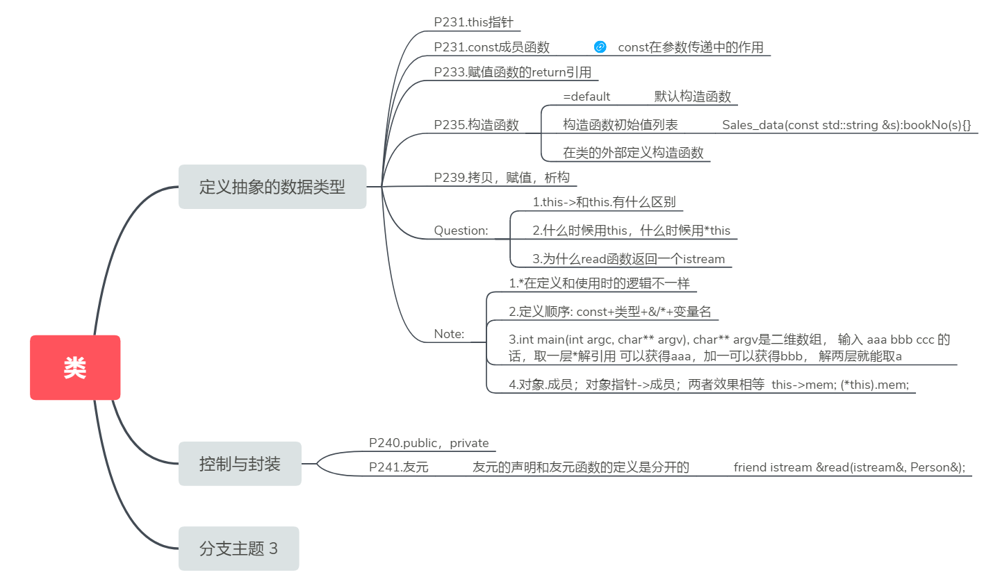

# 1. 类的基础
-----------



## 1.1. 定义一个简单的类（抽象数据类型）
### 1.1.1. 定义类的成员函数
#### 1.1.1.1. 构造函数
构造函数定义了类的对象被初始化的方式，构造函数是特殊的成员函数：
* 构造函数没有返回类型，函数名与类名一致
* 构造函数不能被声明为const
>当我们创建类的一个const对象时，直到构造函数完成初始化的过程，对象才真正取得其“常量”属性，因此，构造函数在const对象的构建过程中可以向其写值。

构造函数可以有以下几种写法：
```cpp
class Sales_data
{
public:
	//构造函数
	Sales_data() = default;                                    //默认构造函数
	Sales_data(const std::string &s):bookNo(s){}               //构造函数初始值列表
	Sales_data(std::istream &);                                //类的外部定义构造函数
	Sales_data(const std::string &s, unsigned n, double p);    //类的外部显式赋值
}
```
如果函数是const，引用，或者属于某种未提供默认构造函数的类类型。我们必须通过构造函数初始值列表为这些成员提供初值<br>
构造函数初始化列表中的初始化顺序与类中的定义顺序有关，与初始化列表顺序无关

```cpp
Sales_data(std::string s = ""):bookNo(s){}
```
如果一个构造函数为所有参数都提供了默认实参，则他实际上也定义了默认构造函数

```cpp
Sales_data::Sales_data(std::istream &is)
{
	read(is, *this);
}

Sales_data::Sales_data(const std::string &s, unsigned n, double p)
{
	this->bookNo = s;
	this->units_sold = n;
	this->revenue = n * p;

}
```

#### 1.1.1.2. 委托构造函数

```cpp
//普通构造函数
Sales_data(const std::string &s, unsigned n, double price):bookNo(s), units_sold(n), revenue(n*price){}
//委托构造函数
Sales_data() : Sales_data("", 0, 0){}
Sales_data(std::string s) : Sales_data(s, 0, 0){}
Sales_data(std::istream &is) : Sales_data() { read(is, *this) }
```
委托构造函数委托其他构造函数实现一部分功能

#### 1.1.1.3. 静态成员函数

```cpp
	string Getname() const { return name; }		// const在参数传递中的作用 https://blog.csdn.net/zheng19880607/article/details/23883437
	string Getadress() const { return adress; }	// 声明为const成员变量可以保证不会修改数据成员
```
#### 1.1.1.4. 赋值函数
函数的返回值作为引用传递
>引自P247<br>
>返回引用的函数是左值的，意味着这些函数返回的是对象本身而非副本。如果我们把一系列操作连接在一条表达式中的话这些操作将在同一个对象上执行
>```cpp
>myScreen.move(4,0).set('#');
>```
>假如定义的返回类型不是引用，则move的返回值将是*this的书本，set只能改变临时副本，而不能改变myScreen的值。
>```cpp
>Screen temp = myScreen.move(4,0);
>temp.set('#');
>```
<br>

```cpp
Sales_data& Sales_data::combine(const Sales_data &rhs)	//函数返回左值
{
	units_sold += rhs.units_sold;
	revenue += rhs.revenue;
	return *this;										//返回一个 this 指针的解引用，即执行该函数的对象
}
```

### 1.1.2. this指针
this指针代表指向该类的实例的指针，\*this代表该类的实例<br>
this-> member 与 （*this).member 相等

## 1.2. 封装类的数据
### 1.2.1. 使用private来封装
使用private封装类的内部实现，所有非类的成员都无法访问private成员<br>
修改private成员时无需考虑客户代码，只需保证最终类的接口不改变即可

### 1.2.2. 友元
**外部函数**声明为友元必须声明在类的内部，除此之外在类的外部也需要有函数声明<br>
**类**也可以声明为友元，声明为友元的类可以调用类中的包括非公有的所有成员<br>
**成员函数**也可以声明为友元，需要标注出其所属的类<br>
重载的函数作为友元需要每一个分别声明<br>
当我们调用被声明成友元的函数时，该函数必须是被声明过的
```cpp
friend ostream &print(ostream&, const Person&);    //外部函数定义为友元
friend class Window_mgr;                           //其他类定义为友元
friend void Window_mgr::clrear(ScreenIndex);       //将其他类的成员函数定义为友元
```
>想要令某个成员函数作为友元，必须仔细组织程序的结构以满足声明和定义的彼此依赖关系，以P251程序为例：
>* 首先定义Window_mgr类，其中声明clear函数，但是不能定义它，在clear使用Screen成员之前必须先声明Screen。
>* 接下来定义Screen，包括对于clear的友元的声明。
>* 最后定义clear, 此时他才可以使用Screen的成员。

# 2. 类的其他特性
## 2.1. 类的其他成员
### 2.1.1. 内联成员函数
>定义在类内部的成员函数是自动inline的， 因此，类的构造函数默认是inline函数<br>
>内联函数可以避开函数调用开销，在调用的时候直接内联地展开
```cpp
cout << shorterString(s1, s2) << endl;
cout << (s1.size() < s2.size() ? s1 : s2) << endl;
```
### 2.1.2. mutable 可变数据成员
声明为mutable的变量即使在const成员函数中也可以改变值

### 2.1.3. const重载
通过区分成员函数是否是const的，可以对其进行重载

## 2.2. 类的作用域
类的编译顺序：
类成员声明时遇到没定义的名字时，将会返回上一层找而不会往类没查找完的部分找
成员定义中普通块作用域的名字查找
* 首先，在成员函数内查找该函数名字的声明，和前面一样，只有在函数使用之前出现的声明才被考虑。
* 如果在成员函数内没有找到，则在雷内继续查找，这时类的所有成员都可以被考虑
* 如果类内也没找到该名字的声明，在成员函数定义之前的作用域内继续查找

### 2.2.1. 默认构造函数的作用
当对象被默认初始化或者值初始化时

### 2.2.2. 转换构造函数
当一个构造函数只接受一个实参时，可以视为转换构造函数，当需要使用类的地方可以使用该实参替代
```cpp
string null_book = "9-999-99999-9";
item.combine(null_book);
```
此处调用了Sales_data的string构造函数
* 只允许一步类类型转换
* 将构造函数加入explicit将抑制构造函数的隐式转换
* explicit构造函数不能用于拷贝初始化
```cpp
explicit Sales_data(const std::string &s) : bookNo(s){}
item.combine(null_book) //错误,explicit构造函数不能隐式转换
Sales_data item1(null_book) //正确:直接初始化
Sales_data item2 = null_book //错误：不能用于拷贝初始化
```
